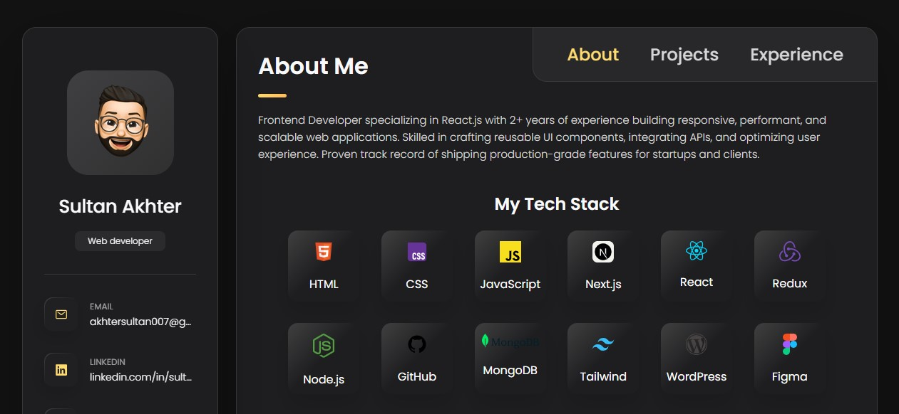
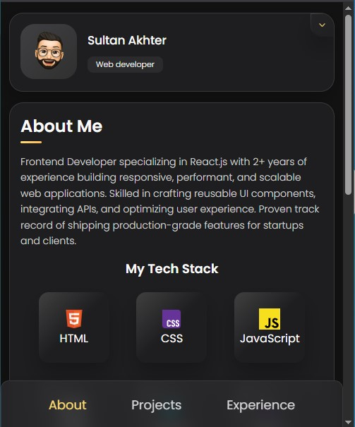

# AKverse – Personal Portfolio

  
  


**AKverse** is my personal portfolio website — fully responsive across all devices — built with **HTML**, **CSS**, and **JavaScript**.  
It’s designed to showcase my work, skills, and projects in a clean and modern way.

---

## 🚀 Demo

  


---

## 📦 Prerequisites

Before you begin, make sure you have:

- [Git](https://git-scm.com/downloads) installed on your system

---

## 📥 Installation

Clone the repository to your local machine:

**Linux / macOS:**

```bash
sudo git clone https://github.com/I-sultan0/akverse.git
```
